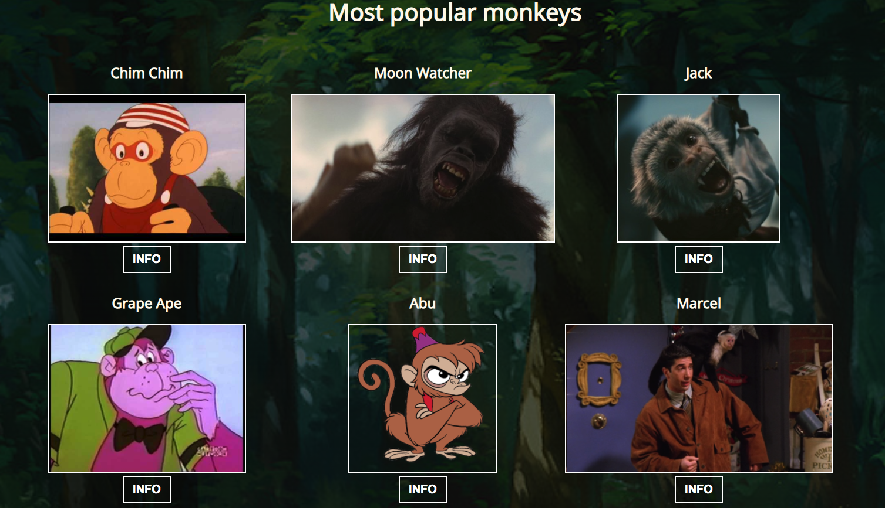

# Popular Monkeys
Implement functionality to render with Handlebars the six most popular monkeys

    
    
     
    
    
    
    

    

## Node Required
### Run 
    npm i

## Popular Monkeys

    

## File Structure 
    📦popular-monkeys
    ┣ 📂css
    ┃ ┗ 📜style.css
    ┣ 📂images
    ┃ ┣ 📜abu.png
    ┃ ┣ 📜chim-chim.jpg
    ┃ ┣ 📜forest.jpg
    ┃ ┣ 📜grape-ape.jpg
    ┃ ┣ 📜jack.png
    ┃ ┣ 📜marcel.png
    ┃ ┣ 📜monkey-page.png
    ┃ ┣ 📜monkeyOne.gif
    ┃ ┣ 📜monkeyTwo.gif
    ┃ ┗ 📜moon-watcher.jpg
    ┣ 📂js
    ┃ ┣ 📜monkeys.js
    ┃ ┗ 📜monkeysTemplate.js
    ┣ 📂node_modules
    ┣ 📜.gitignore
    ┣ 📜README.md
    ┣ 📜index.html
    ┣ 📜package-lock.json
    ┗ 📜package.json

## Functionality Monkeys
### Info Button Show

    

### Info Button Hide

    

